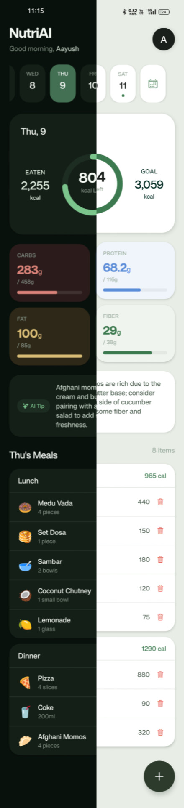
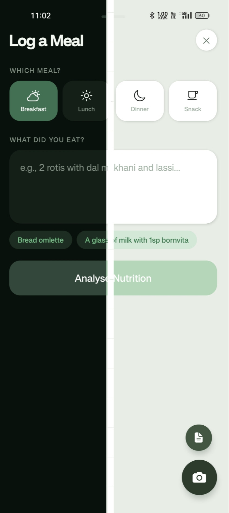
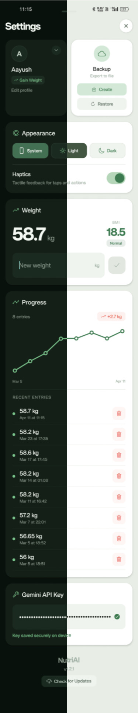
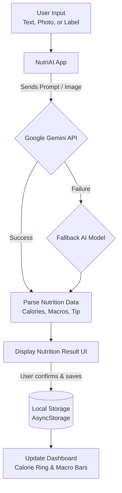
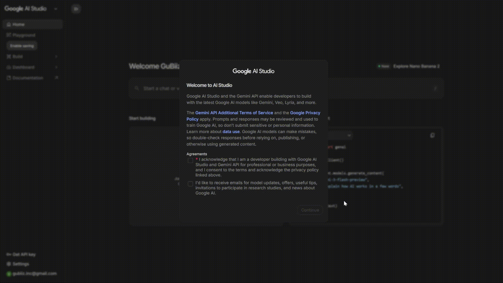

# NutriAI

AI-powered calorie and nutrition tracker built with React Native and Google Gemini. Describe what you ate in plain language and get instant nutritional analysis with personalized daily goals.

Built with a focus on **Indian cuisine** — understands roti, dal, idli, dosa, poha, rajma chawal, and more — while supporting global foods too.

---

## Screenshots

<!-- HOW TO ADD SCREENSHOTS + VIDEO:
  1. Open this file on GitHub.com → click the pencil (Edit) icon
  2. Drag and drop your image/video files anywhere into the editor
  3. GitHub uploads each file and inserts a CDN URL automatically
  4. Paste those URLs into the src attributes below, then commit
-->

|     Dashboard      |      Log Meal      |      Profile       |
| :----------------: | :----------------: | :----------------: |
|  |  |  |

---

## Features

- **AI Meal Logging** — Type what you ate in natural language, take a photo of your plate, or scan a food packaging label. Gemini AI automatically analyzes the nutrition and returns calories, protein, carbs, fat, fiber, and a friendly nutrition tip. You can even add text notes alongside photos for precise tracking.
- **Dark Mode & Themes** — Choose between light, dark, and system default themes for a comfortable viewing experience anywhere.
- **Food Suggestions** — Quick-tap suggestion chips with common Indian meals to pre-fill the log input.
- **Personalized Goals** — Calorie and macro targets calculated from your age, gender, weight, height, fitness goal, and activity level using the Mifflin-St Jeor equation.
- **Dashboard** — Animated calorie ring, macro progress bars (carbs, protein, fat, fiber), date navigation, and meal history at a glance.
- **Meal Management** — Log meals automatically sorted by current time. Remove individual food items with a confirmation modal, and securely back up saved meals.
- **Weight Tracking** — Log weight entries over time, view progress on an SVG graph, track BMI with color-coded categories. Delete individual entries from history.
- **Height Unit Toggle** — Switch between cm and ft/in in the profile form; values are auto-converted.
- **In-App Update Checker** — Check for new releases from GitHub directly in Settings. Shows Markdown-rendered release notes and a direct download link, including automatic checks on app launch.
- **Fallback AI Model** — If the primary Gemini model is unavailable, the app automatically retries with a fallback model.
- **Backup & Restore** — Export all your data as a JSON file and restore it on any device. API key is never included in backups.
- **Secure by Default** — Your Gemini API key is stored in the device's secure enclave via `expo-secure-store`. All data stays on your device.
- **Haptic Feedback** — Tactile responses on interactions throughout the app, with an option to toggle it off in settings.

## Why NutriAI?

Most calorie tracking apps are slow, cluttered, and require manually searching through large food databases. NutriAI takes a different approach.

**Natural Language Logging**
Just describe what you ate — no scrolling through long food lists. The AI understands real meals like "2 roti with dal and sabzi".

**No Ads, No Tracking**
NutriAI is designed as a clean experience. No ads, no trackers, and no unnecessary data collection.

**Your Data Stays On Your Device**
All user data (meals, profile, weight logs) is stored locally on your phone. Nothing is uploaded to external servers. Even backups are exported manually as JSON files that you control.

**Works With Real Food**
Unlike many trackers focused on packaged Western foods, NutriAI understands common Indian meals such as roti, dal, poha, dosa, rajma chawal, and more.

**No Locked Analytics**
Most nutrition apps hide useful insights behind subscriptions. NutriAI keeps dashboards, weight tracking, and macro analytics fully accessible.

**Built for Simplicity**
The goal is to make calorie tracking frictionless: type your meal, get instant analysis, and move on with your day.

## Tech Stack

| Layer        | Technology                                                     |
| ------------ | -------------------------------------------------------------- |
| Framework    | React Native 0.81 + Expo SDK 54                                |
| Routing      | Expo Router (file-based)                                       |
| AI           | Google Gemini API (`gemini-3.1-flash-lite-preview` + fallback) |
| State        | React Context (ProfileContext, MealContext)                    |
| Storage      | AsyncStorage + SecureStore                                     |
| Animations   | React Native Reanimated 4, Animated API                        |
| Charts       | react-native-svg (Polyline, Circle)                            |
| Architecture | React Native New Architecture + React Compiler                 |

## Project Structure

```
nutriai/
├── app/                          # Screens (file-based routing)
│   ├── _layout.jsx               # Root layout, providers, onboarding gate
│   ├── index.jsx                 # Dashboard screen
│   ├── log.jsx                   # Log meal screen
│   └── profile.jsx               # Settings, weight, and backup screen
│
├── components/
│   ├── Onboarding.jsx            # 6-step onboarding orchestrator
│   │
│   ├── dashboard/                # Dashboard screen components
│   │   ├── AiTip.jsx             # AI tip pill badge
│   │   ├── CalorieHeroCard.jsx   # Calorie display card
│   │   ├── CalorieRing.jsx       # Animated progress ring
│   │   ├── DashboardHeader.jsx   # Greeting and profile avatar
│   │   ├── DateStrip.jsx         # Scrollable date selector
│   │   ├── LogMealButton.jsx     # Action button for logging meals
│   │   ├── MacrosRow.jsx         # Macro nutrient grid
│   │   ├── MealSection.jsx       # Meal category card
│   │   └── MealsList.jsx         # Renders all daily meals
│   │
│   ├── log/                      # Log meal components
│   │   ├── FoodInput.jsx         # Text input for describing food
│   │   ├── MealTypeSelector.jsx  # Meal category selector
│   │   └── NutritionResult.jsx   # AI analysis result card
│   │
│   ├── onboarding/               # Onboarding step components
│   │   ├── WelcomeStep.jsx       # Intro screen
│   │   ├── BasicInfoStep.jsx     # Name, age, gender input
│   │   ├── BodyMetricsStep.jsx   # Weight and height input
│   │   ├── GoalStep.jsx          # Fitness goal selection
│   │   ├── ActivityStep.jsx      # Activity level selection
│   │   ├── ApiKeyStep.jsx        # Gemini API key entry
│   │   ├── ThemeStep.jsx         # Theme selection
│   │   ├── Chip.jsx              # Reusable selectable chip
│   │   ├── LabelInput.jsx        # Labelled text input field
│   │   ├── StepDots.jsx          # Step indicator
│   │   └── stepStyles.js         # Shared onboarding styles
│   │
│   └── profile/                  # Profile & Settings components
│       ├── ProfileForm.jsx       # Editable profile fields
│       ├── UpdateModal.jsx       # In-app update modal
│       ├── WeightGraph.jsx       # SVG line graph
│       └── WeightSection.jsx     # Weight display and log input
│
├── context/                      # State management
│   ├── ProfileContext.jsx        # Profile, goals, and weight history state
│   ├── MealContext.jsx           # Meal data and totals state
│   └── ThemeContext.jsx          # Theme state management
│
├── constants/                    # App-wide constants
│   ├── theme.js                  # Colors, scaling, and shadows
│   └── gemini.js                 # Gemini API integration logic
│
├── assets/images/                # App icons
└── docs/                         # README media
```

### Flow Diagram



## Download

Grab the latest APK from [GitHub Releases](../../releases/latest) and install it directly on your Android device — no build tools needed. iOS users can try the app via [Expo Go](https://expo.dev/go).

1. Go to the [Releases](../../releases) page
2. Download the `.apk` file from the latest release
3. Open it on your Android phone and follow the install prompt
4. You may need to enable **Install from unknown sources** in your device settings

> You'll still need your own Gemini API key to use AI meal logging. Get one for free at [aistudio.google.com](https://aistudio.google.com/).

## Get Your API Key

1. Go to [aistudio.google.com](https://aistudio.google.com/)
2. Create a free API key
3. Enter it during onboarding or in the Settings page

**Video walkthrough:**

<!-- Convert your screen recording to a GIF, put it in docs/api-key-guide.gif, then commit -->


## Getting Started

### Prerequisites

- Node.js 18+
- A [Google Gemini API key](https://aistudio.google.com/) (free tier available)

### Setup

```bash
# Clone the repo
git clone https://github.com/aayush-bindal/nutriai.git
cd nutriai

# Install dependencies
npm install

# Start the dev server
npx expo start
```

Scan the QR code with **Expo Go** on your phone, or press `a` for Android emulator / `i` for iOS simulator.

## How It Works

1. **Onboarding** — Enter your details (name, age, gender, weight, height, goal, activity level). The app calculates your daily calorie and macro targets.
2. **Log a meal** — Tap the log button and describe your meal: _"2 roti with dal makhani and raita"_. Gemini AI analyzes it and returns a full nutritional breakdown.
3. **Track progress** — View your daily intake on the dashboard. Log your weight over time and watch the progress graph.
4. **Backup your data** — Export everything as a JSON file from Settings. Restore it anytime, even during onboarding on a new device.
5. **Stay updated** — Tap **Check for Updates** in Settings to see if a new release is available on GitHub.

## Nutrition Calculation

- **BMR**: Mifflin-St Jeor equation
- **TDEE**: BMR × activity multiplier (1.2–1.725)
- **Calorie goal**: TDEE adjusted for goal (−400 lose, +300 gain)
- **Protein**: 1.6–2.0 g/kg body weight based on goal
- **Fat**: 25% of calorie goal
- **Carbs**: Remaining calories after protein and fat
- **Fiber**: 38g (male) / 25g (female) per dietary guidelines

## License

This project is licensed under the [GNU General Public License v3.0](LICENSE).

You are free to use, modify, and distribute this project, but any derivative work must also be open source under the same license.
